---
marp:true
math:mathjax
theme:"default"
pageinate:true
---

# Custom Kernels for Clustering/Classification
### Adam Handwerger

---

Difficult for standard kernels when the number of clusters, K $\geq 3$

Example1: Clusters that form concentric hyperspheres.
It would seem that the standard Guassian Kernel should do the trick.

Unfortunately the cost function is actually minimized for a grouping like the following:

---

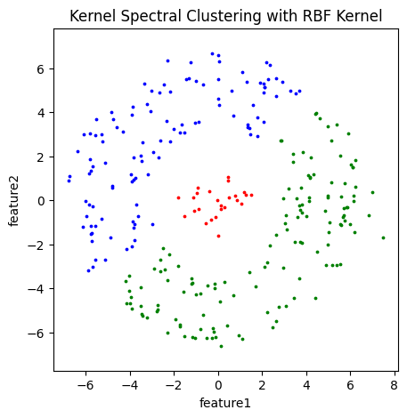

---
Based on the symmetry of the data set, let's develope a custom kernel to solve this problem.

The sklearn package has features that allows you you use custom kernels in the spectral clustering algorithm.
For this example let's use

$$k(x,y)=\exp( -\alpha |(||x||-||y||)|)$$

where $\alpha$ is an adjustable parameter.
Choosing this kernel with $\alpha=0.5$ gives a better grouping.

---

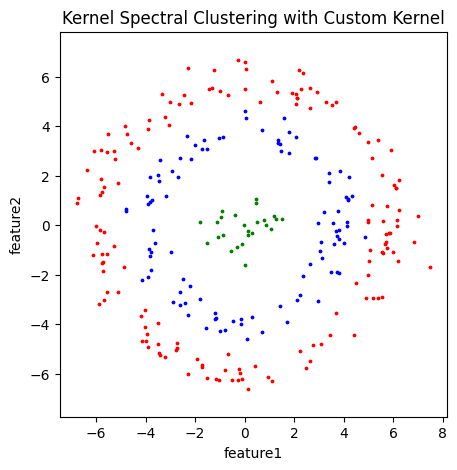

---

Finally check to see if $k$ is p.d.
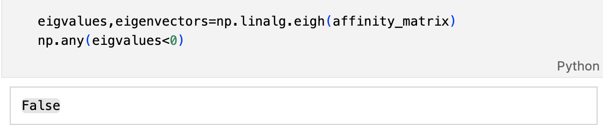

---

For the second example consider a data set with some angular symmetry.

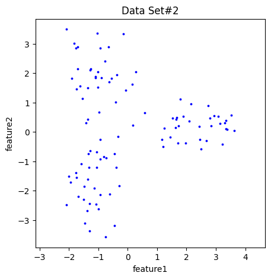

---

Spectral Custering Clustering gives a good grouping when the $\gamma$ parameter is adjusted correctly using the 'rbf' affinity setting.

---

Unfortunately, $\gamma$ is sensistive to noise.

When more noise was added to the data $\gamma$ had to be adjusted from 10 to 0.1. See plots below.

Let's see if we can find a kernel that will give a good grouping that is not as sensitive to noise.

Consider the kernel,
$$k(x,y)=|\cos(\alpha||x-y||)|$$

---

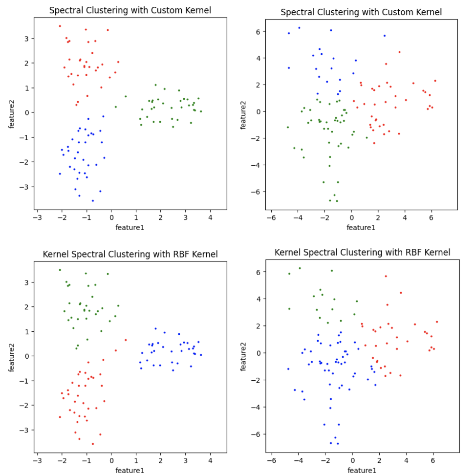

---

For the upper plots both have $\alpha=0.1$ and for the lower plots $\gamma=10$ and $\gamma=0.1$ left to right.

---

Let's check if $k$ is p.d.

OOPPS! But not all is lost
Let's instead consider the Kernel $k^{\prime}=k+\epsilon I$, with $\epsilon=0.2$
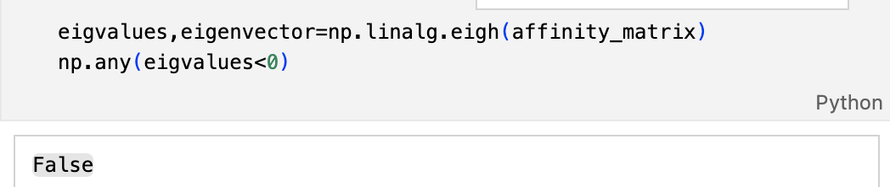

---

It turns out that $k^{\prime}$ works just as well as $k$ above
and the eigenvalues are now non-negative.
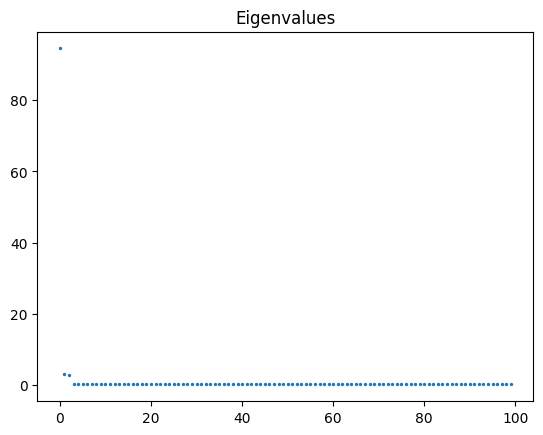

---

Example3. Consider the following data set from Sklearn

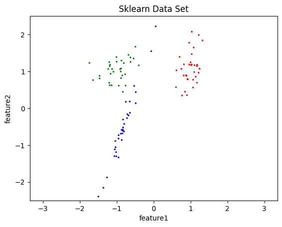

To find a similiar grouping based on kernel methods will require two steps.

---

Step1: Initially, group with Spectral Clustering using 'rbf' affinity.

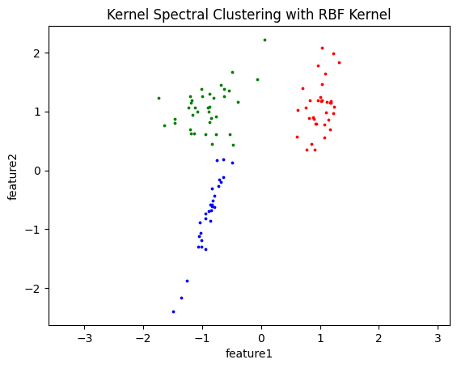

The spectral clustering does a descent job but misses the idea that the middle cluster separates the first a third clusters.

---
Step2: Follow up with the custom kernel

We can use the results from the spectral clustering to estimate a line that predicts where the middle cluster should extend using linear regression.

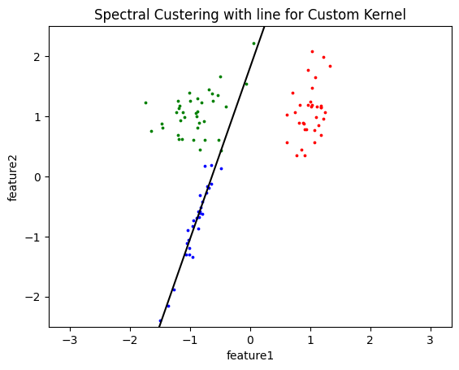

---

Now let's design a kernel which is a function of distance between points, but measured only in the orthogonal direction to this line.

With a little geometry we can see that the following kernel will do just that.

$$k(x,y)=\exp(-\alpha|mx[0]-x[1]-my[0]+y[1]|\sqrt{(1+m^2)})$$

where m is the slope of the line and $\alpha$ is an adjustible parameter.

---

Let's make sure $k$ is p.d.
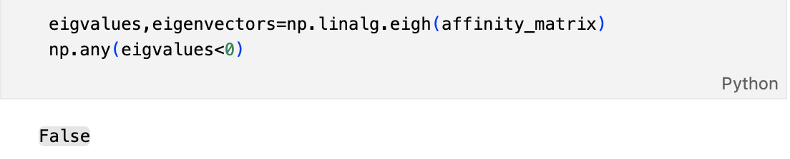
And here's the finally clustering:

---

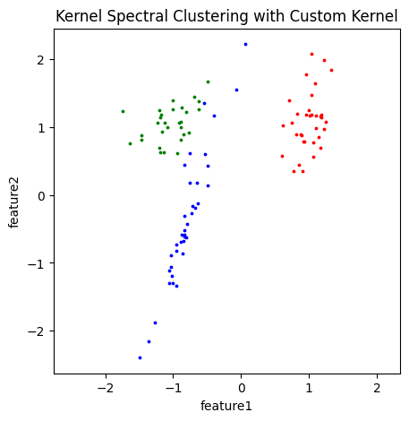