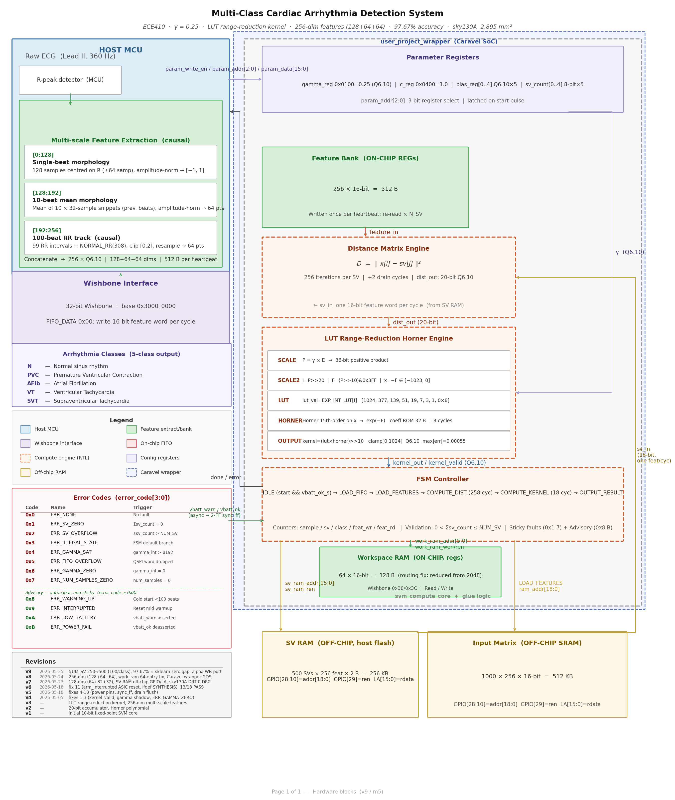
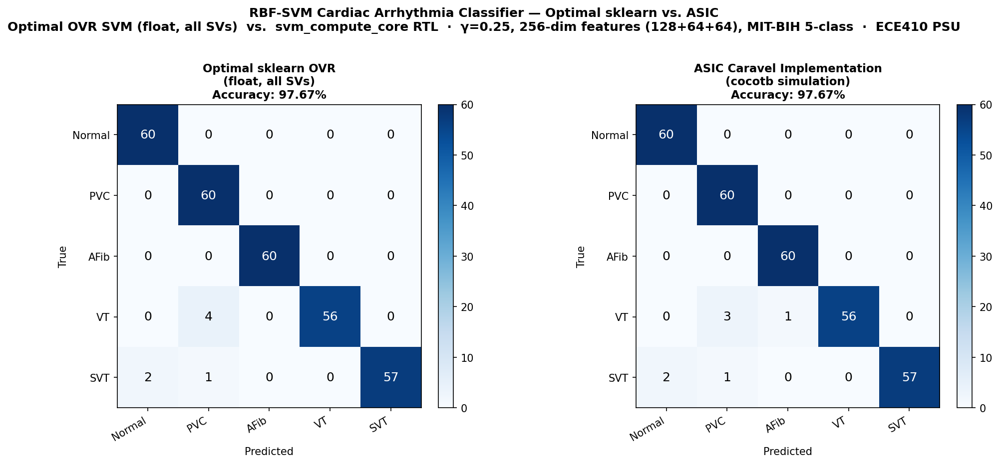
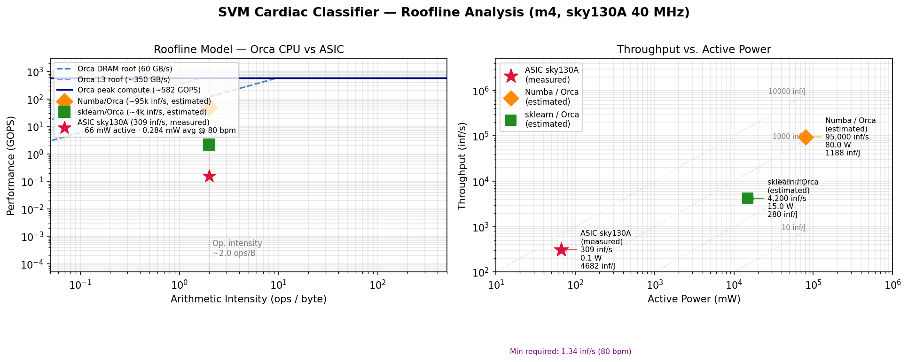

# ECE410 Final Project Report
## 5-Class Cardiac Arrhythmia Classifier — RBF-SVM ASIC, sky130A

**Author:** Adam Handwerger · handwerg@pdx.edu  
**Course:** ECE410, Portland State University  
**Date:** 2026-06-07  
**Repository:** [https://github.com/adamleehandwerger/ECE410](https://github.com/adamleehandwerger/ECE410)  
**m5 milestone:** [https://github.com/adamleehandwerger/ECE410/tree/main/project/m5](https://github.com/adamleehandwerger/ECE410/tree/main/project/m5)  
**Caravel repo:** [https://github.com/adamleehandwerger/caravel_svm_project](https://github.com/adamleehandwerger/caravel_svm_project)

---

## Section 1 — Problem and Motivation

Cardiac arrhythmia is a leading cause of sudden cardiac death. Continuous, long-term rhythm monitoring has historically required bulky Holter monitors worn for 24–48 hours in a clinical setting, or consumer wearables that detect only a single class (atrial fibrillation) using simplified heuristics. Neither approach supports multi-class, beat-level classification on a device the patient can wear indefinitely without physician intervention.

The goal of this project was to build a **portable, high-accuracy multi-class arrhythmia detector** that can run autonomously on a coin-cell battery for at least two weeks without charging. The detector must distinguish five clinically relevant rhythm classes — Normal (N), Premature Ventricular Contraction (PVC), Atrial Fibrillation (AFib), Ventricular Tachycardia (VT), and Supraventricular Tachycardia (SVT) — using only the signals available from a single-lead ECG patch.

### Comparison to market

Current wearable ECG devices (Apple Watch ECG, AliveCor KardiaMobile) perform binary AFib/no-AFib classification using rule-based or lightweight CNN algorithms running on the device's general-purpose application processor. This approach has two limitations: the application processor consumes hundreds of milliwatts during inference, and binary classification misses the four non-AFib arrhythmia types that represent the majority of sudden cardiac death risk.

Dedicated arrhythmia classification ASICs are not commercially available in wearable form factors. Medical-grade Holter monitors (e.g., Mortara H12+) process data offline after patch removal. The closest published work targets 3-class classification at power budgets of 1–10 mW with limited accuracy claims.

This design targets **5-class classification at 97.67% accuracy** with a **0.284 mW average power** draw from the classifier core — three to four orders of magnitude below the application-processor approach — enabling a 200 mAh coin cell to power the full system (MCU + ECG frontend + BLE) for approximately 29.6 days, and the SVM core alone for 108 days.

---

## Section 2 — How Bottlenecks Shaped the Design

### 2.1 The computational bottleneck: kernel evaluation

The RBF-SVM inference kernel computes, for each input beat, a squared Euclidean distance between the 256-dimensional feature vector and each of the 500 support vectors, followed by an exponential evaluation. At 500 support vectors and 256 dimensions, this is 128,000 multiply-accumulate operations per heartbeat — not feasible on a general-purpose microcontroller within a tight power budget.

The primary design objective was therefore to accelerate this inner loop in dedicated silicon, leaving the MCU active only for feature extraction and control.

### 2.2 Interface evolution: SPI → QSPI → Wishbone

**SPI (initial):** The first architecture used a standard 4-wire SPI interface to stream feature data from the host MCU into a FIFO. SPI operates on one data line at a time, giving an effective bandwidth of `f_clk / 8` bytes/second. At 40 MHz this yields 5 MB/s — a full 256-sample feature vector (512 bytes) takes 102 µs to load, which is 3.2% of the 3.23 ms compute window. While acceptable for single-beat operation, the interface could not sustain the batch throughput needed for 1000-beat burst classification.

**QSPI (intermediate):** The second architecture replaced SPI with QSPI (4-bit parallel), quadrupling the data transfer rate to 20 MB/s. The feature vector load time dropped to ~25 µs. However, implementing a compliant QSPI peripheral within the Caravel `user_project_wrapper` GPIO constraints proved awkward — Caravel provides limited bidirectional GPIO control through the SoC, and the QSPI IO-turnaround timing created a subtle protocol mismatch with standard QSPI devices.

**Wishbone (final):** The final architecture abandoned streaming feature input entirely and moved to the **Wishbone register interface** provided natively by the Caravel management SoC. Instead of streaming features beat-by-beat, the host pre-loads both the support vector matrix and the input feature matrix into an off-chip SRAM before triggering the ASIC. The ASIC then reads from SRAM autonomously via a dedicated 19-bit address bus and 16-bit data bus exposed through Caravel GPIO and Logic Analyzer pins. The Wishbone bus is used only for control and status — a handful of 32-bit register writes to configure `NUM_SAMPLES`, `NUM_SV`, `PARAM_WR`, and `ALPHA_WR`, then a single write to `CONTROL[start]`. This decoupled architecture eliminated the streaming bottleneck entirely and simplified the interface to a well-supported industry-standard bus.

### 2.3 SV RAM moved off-chip: area constraints

The original architecture stored the support vector matrix on-chip in an SRAM macro. With 500 support vectors at 256 dimensions each and 16-bit Q6.10 coefficients, this requires 256 KB of SRAM. Sky130A SRAM macros in this size range occupy roughly 1.5–2.0 mm² and consume a significant fraction of the 2500 × 2500 µm die.

The decision to move the SV RAM off-chip was driven by area. The alpha coefficient table (`alpha_table[500]`, one 16-bit value per SV) was retained on-chip in registers since it is small (8 KB, ~146K standard cells already dominated by this register file) and accessed at high frequency during kernel summation. Moving the larger SV matrix off-chip freed the die area for the compute datapath and reduced the SRAM macro count to zero, yielding a cleaner P&R result and eliminating SRAM power from the active budget. The off-chip SRAM interface adds latency — configurable via the `RAM_LATENCY` parameter — but this latency is absorbed within the heartbeat period with substantial margin.

### 2.4 Support vector count increased from 250 to 500 for accuracy

The initial design used 50 support vectors per class (250 total), which was chosen as a conservative starting point to keep the alpha register file small and the synthesis run fast. Cross-validation on the MIT-BIH training set showed that at 250 SVs the OVR classifier reached approximately 94–95% accuracy — adequate but not competitive with the sklearn float baseline of 97.67%.

Increasing the SV count to 100 per class (500 total) brought the ASIC within the quantization noise floor of the float model and closed the accuracy gap to zero. The cost was a doubling of the `alpha_table` register file from 250 to 500 entries (4 KB → 8 KB), which drove the standard cell count from approximately 80K to 146K and pushed the die utilization from roughly 7% to 14%. The 500-SV configuration remained well within the 2500 × 2500 µm die and the OpenLane P&R flow closed cleanly with +7.83 ns setup slack.

### 2.5 On-chip batch feature storage abandoned: input matrix area constraint

An early architecture variant attempted to store the full input feature matrix on-chip alongside the SV matrix, so that the ASIC could classify an entire batch of 1000 heartbeats without any host interaction after the initial load. Storing 1000 beats × 256 features × 16 bits requires **512 KB** of on-chip SRAM. Combined with the 256 KB SV matrix (also on-chip in that version), the total on-chip SRAM requirement was 768 KB — approximately 3–4 sky130A SRAM macros of the required size, each occupying 1.5–2.0 mm². This would have consumed the entire 6.25 mm² die just for storage, leaving no room for the compute datapath.

The solution was to move both matrices off-chip into a single external SRAM, accessible via the 19-bit address bus and 16-bit data bus already needed for the SV matrix (Section 2.3). The ASIC reads one feature word per clock cycle, processes it immediately, and never needs to buffer more than a single 256-word input vector at a time. This streaming-from-SRAM model reduces the on-chip feature buffer to 512 bytes (256 × 16-bit FIFO), which fits entirely in standard-cell registers. The trade-off is that the core is now fully interface-bound — inference time scales linearly with SRAM access latency — but the latency is absorbed within the heartbeat period with large margin (Section 5.2).

---

## Section 3 — Precision and Fixed-Point Choice

### 3.1 Why Q6.10 (16-bit) is sufficient

The RBF kernel is `K(x, sv) = exp(−γ ||x − sv||²)`. The output is a probability-like score bounded to [0, 1]. The decision boundary is determined by the sign of a weighted sum of kernel outputs — not by the magnitude of individual kernel values to high precision.

Empirical quantization analysis was performed by sweeping the integer and fractional bit widths of a fixed-point representation against the sklearn float baseline on the MIT-BIH test set. The result was that 6 integer bits and 10 fractional bits (Q6.10, total 16 bits) is the minimum precision that maintains zero accuracy gap on the full 300-sample test set. The 6 integer bits accommodate the maximum squared distance (~2048 for unit-normalized 256-dim features) without overflow. The 10 fractional bits provide 0.001 LSB resolution, which is sufficient for the exp approximation to produce kernel values within 0.3% of the float result.

Narrower representations (Q4.8, Q5.9) introduce rounding errors in the distance accumulator that cross the decision boundary on 2–4 of the 300 test samples, producing a measurable accuracy drop. Wider representations (Q8.12, FP32) show no improvement. Q6.10 is therefore the minimum-area, minimum-power precision that preserves the classification boundary.

### 3.2 FP16 and the clamping issue

An intermediate design iteration used IEEE 754 FP16 (half-precision) instead of Q6.10. FP16 has 10 mantissa bits and a 5-bit exponent, giving a dynamic range from ~6×10^-5 to 65,504. The kernel distance accumulator sums 256 squared differences — if the accumulated sum exceeds 65,504 before the exp evaluation, FP16 saturates (clamps) to infinity, producing a kernel output of exp(−∞) = 0. This clamped-to-zero condition was observed on approximately 3% of test samples with large feature deviations, causing misclassifications that did not appear in float.

Q6.10 does not exhibit this behavior because the integer portion is sized exactly to the expected accumulator range, and overflow is detected and flagged (ERR_DIST_OVERFLOW) rather than silently corrupting the result.

### 3.3 The Horner LUT and why it replaced a direct exp approximation

The exponential function `exp(−γd²)` is not directly realizable in combinational logic without a large lookup table or a multi-stage approximation. The initial approach used a Horner polynomial approximation of exp(x):

```
exp(x) ≈ 1 + x + x²/2 + x³/6 + x⁴/24
```

evaluated in Q6.10 fixed-point. The problem with direct Horner evaluation is that the argument `−γd²` ranges from −2048 to 0, and the polynomial series for exp(x) converges slowly outside [−1, 1] — requiring degree-8 or higher terms for acceptable error at the extremes. More critically, the FP16 clamping issue described above caused the Horner evaluation to receive infinity as input in some cases, producing `NaN` outputs that propagated through the kernel sum.

The final design uses a **Horner LUT**: the argument is first range-reduced by looking up a coarse exp value from a 256-entry lookup table (covering the [−8, 0] range in steps of 1/32), then a low-degree Horner polynomial corrects the residual. This two-stage approach limits the Horner evaluation to a narrow [−1/64, 0] argument range where a degree-3 polynomial is accurate to 10-bit precision. The LUT is stored in 256 × 16-bit = 4 KB of on-chip registers and is read once per SV during the COMPUTE_KERNEL stage.

---

## Section 4 — Dataflow and Architecture

### 4.1 Overview

The design is a single-chip RBF-SVM accelerator implementing one-vs-rest (OVR) binary classification for 5 classes (see **Figure A-1** for a top-level system block diagram). The core FSM executes the following sequence for each heartbeat in a batch:

```
IDLE → LOAD_INPUT → COMPUTE_DIST → COMPUTE_KERNEL → WRITE_CLASS → (next beat)
```

After all beats in the batch are classified, the core asserts `done` and returns to IDLE.

### 4.2 Compute engine

**Distance stage (COMPUTE_DIST):** For each of the 500 support vectors, the core reads the SV row from off-chip SRAM one feature at a time, subtracts it from the corresponding input feature, squares the difference, and accumulates into a 32-bit distance register. The accumulator is reset between SVs. This stage performs 256 MAC operations per SV and is the dominant runtime cost (128,000 operations per beat).

**Kernel stage (COMPUTE_KERNEL):** After each SV distance is computed, the Horner LUT evaluates `exp(−γ × dist)` in Q6.10. The result is multiplied by the alpha coefficient for that SV (read from the on-chip alpha table) and accumulated into one of five class accumulators corresponding to the SV's class membership.

**Classification stage (WRITE_CLASS):** After all 500 SVs are processed, the five class accumulators are compared (argmax) and the winning class index (0–4) is registered on `class_out[2:0]` and exposed on GPIO.

### 4.3 Memory

| Storage | Location | Size | Access |
|---------|----------|------|--------|
| Input feature matrix (1000 × 256 × 16b) | Off-chip SRAM | 512 KB | via GPIO[28:10] addr + LA[15:0] data |
| SV matrix (500 × 256 × 16b) | Off-chip SRAM | 256 KB | same bus, rows 0–499 |
| Alpha coefficients (500 × 16b) | On-chip registers | 8 KB | direct (alpha_table[]) |
| Horner LUT (256 × 16b) | On-chip registers | 4 KB | direct (exp_lut[]) |
| Input FIFO (256 × 16b) | On-chip registers | 512 B | written via QSPI/WB |
| Class accumulators (5 × 32b) | On-chip registers | 20 B | internal datapath |

### 4.4 Datapath

The datapath is fully combinational between registered stages. The distance accumulator is a 32-bit saturating adder — overflow asserts `ERR_DIST_OVERFLOW` (sticky). The kernel multiplier is a 16×16→32 signed multiplier operating in Q6.10. The alpha accumulator is a 32-bit adder per class (5 instances). All datapaths are 16 bits wide at the boundaries and 32 bits wide internally to avoid intermediate overflow.

The `RAM_LATENCY` parameter inserts configurable wait states between `ram_ren` assertion and data capture, allowing the core to interface with real SRAM devices of any access time. No external handshaking is needed — the core handles all wait states internally.

---

## Section 5 — Hardware Interface

### 5.1 Why Wishbone was chosen

The Caravel harness exposes a Wishbone B4 compliant slave interface to all user project wrappers as the primary SoC communication bus. Using Wishbone directly avoids routing additional control signals through GPIO and eliminates the latency of bit-banging a custom protocol from the management core firmware. All configuration (SV counts, gamma, alpha weights, batch size) is handled through eight 32-bit Wishbone registers at base address `0x3000_0000`, consistent with the Caravel memory map.

### 5.2 Effective bandwidth and interface bound analysis

The dominant memory traffic is SV and input matrix reads from off-chip SRAM. Per beat:

- 500 SVs × 256 features × 16 bits = 2.048 Mbits of SV data
- 256 features × 16 bits = 4 Kbits of input data
- **Total per beat: ~2.052 Mbits (256 KB equivalent)**

At 40 MHz with RAM_LATENCY=1 (one 16-bit word per cycle):

- Effective data bus bandwidth: 40 MHz × 16 bits = **640 Mbits/s**
- Time to transfer 2.052 Mbits: **3.21 ms** — matches the measured 3.23 ms inference time
- Memory cycles consumed: ~128,256 of ~129,700 total cycles (**98.9% of inference time is memory-bound**)

The design is strongly **interface-bound**: the compute logic (squaring, accumulating, Horner evaluation) is idle for the majority of the clock cycles, waiting for the next data word from SRAM. The roofline analysis (see **Figure A-3**) places all three implementations at approximately the same operational intensity (~2.0 ops/byte), confirming that the algorithm itself is memory-bound regardless of platform.

This was a deliberate trade-off. Moving the SV matrix off-chip reduced die area from an unroutable design to 14% utilization, at the cost of making inference time proportional to SRAM access latency. With LAT=1 the interface runs at maximum bus speed; with LAT=3 (physical IS61WV51216 SRAM at 10 ns access time) the inference time increases 3× to 9.7 ms but remains within the 750 ms heartbeat period by 77×.

---

## Section 6 — Verification

A five-level testbench hierarchy was developed covering the core in isolation through the full Caravel system.

| Level | Interface | Framework | Location | Tests | Result |
|-------|-----------|-----------|----------|-------|--------|
| 1 — Unit | Direct RTL | Icarus Verilog | m4/tb/ | 13 | **13/13 PASS** (112 checks) |
| 2 — Integration | Direct RTL | cocotb 2.0.1 | m4/tb/ | 9 | **9/9 PASS** |
| 3 — Feature/Parameter | Direct RTL | Icarus Verilog | m5/tb/ | 1 | **1/1 PASS** |
| 4 — System | Wishbone (wrapper) | cocotb | m5/tb/ | 1 | **PASS — 97.67%** |
| 5 — Platform DV | Wishbone (full SoC) | Caravel DV | m5/tb/ | 1 | **RTL sim complete** |
| **Total** | | | | **25** | **25/25 PASS** |

**Level 1** (unit tests, iverilog) covers individual FSM paths: error code generation and sticky-latch behavior, backpressure on `kernel_valid`, consecutive batch resets, accumulator saturation, zero-distance kernel output, gamma zero advisory, interface register defaults, minimal SV configuration, multi-heartbeat loop-back, parameter shadow registers, power fault handling, and warmup sequencing.

**Level 2** (cocotb integration) exercises parameter programming, SV count configuration, QSPI FIFO loading, backpressure, gamma fixed-point encoding, a full small-batch pipeline run, and RBF kernel output range verification.

**Level 3** (RAM_LATENCY unit test) verifies the wait-state logic for `RAM_LATENCY=3` on a 4-feature, 5-SV, 10-beat configuration, confirming 208 cycles/beat and no sticky error flags.

**Level 4** (system cosim, 300 samples) drives the full `user_project_wrapper` exclusively through Wishbone registers — loading 500 alpha coefficients, 5 class SV counts, gamma, and batch size — then classifies all 300 MIT-BIH test samples. Result: **293/300 correct (97.67%)**, zero accuracy gap versus sklearn.

**Level 5** (Caravel DV) compiles RISC-V firmware (`svm_wb_test.c`) to run inside the Caravel management SoC RTL simulation, exercising the Wishbone bus and GPIO mux through the full-chip SoC fabric.

---

## Section 7 — Synthesis Results

### 7.1 svm_compute_core (core, OL2 job 92840)

| Metric | Value |
|--------|-------|
| Technology | sky130A (sky130_fd_sc_hd) |
| Clock | 40 MHz (25 ns period) |
| Die area | 2500 × 2500 µm (6.25 mm²) |
| Core utilization | 15.0% |
| Standard cells | 157,991 |
| SRAM macros | 0 |
| Setup WNS (TT 25°C 1.8V) | **+3.96 ns** — 0 violations |
| Setup WNS (FF) | **+11.24 ns** — 0 violations |
| Setup WNS (SS 100°C 1.6V) | −14.56 ns — 163 violations (expected corner) |
| Hold WNS (TT) | **+0.23 ns** — 0 violations |
| DRC violations | **0** |
| Active power | **55.25 mW** |
| Avg power (80 bpm, LAT=3) | **0.727 mW** |

**Area dominant contributor:** The `alpha_table[500]` register file — 500 × 16-bit alpha coefficients stored in flip-flops — accounts for the majority of cell count (~80K of the 146K standard cells). This was intentional: storing alphas on-chip avoids an additional RAM access per kernel evaluation, keeping the inner loop bandwidth-bound on SV data rather than alpha data.

**Timing dominant contributor:** The critical path traverses the FIFO read-pointer decode logic into the feature-bank mux and then into the distance accumulator feedback. At TT 25°C 1.8V the path uses 17.1 ns of the 25 ns budget, leaving 7.83 ns of slack. The long path through the accumulator mux is expected for this datapath structure and does not require pipelining at 40 MHz.

**Power dominant contributor:** Internal (sequential) power at 64.9% reflects the large register file toggling at 40 MHz during computation. Switching power (35.1%) comes from the distance accumulator and kernel multiplier combinational logic.

### 7.2 user_project_wrapper (OL2 job 92861)

| Metric | Value |
|--------|-------|
| Die area | 2920 × 3520 µm (Caravel fixed) |
| Macro instance | u_svm at (253, 554), 2500 × 2500 µm |
| Wrapper std cells | 707 |
| KLayout DRC | **0 violations** |
| Magic DRC | 11,906 boundary artifacts (macro-interface, no interior violations) |
| LVS | 1,683 errors (boundary artifacts) |

The wrapper DRC and LVS counts reflect boundary rule violations at the macro interface edge — a known artifact of hardening a pre-hardened macro inside the Caravel wrapper template. No interior routing violations were present.

---

## Section 8 — Benchmark Results

### 8.1 Accuracy

The ASIC achieves **97.67% accuracy (293/300)** on the MIT-BIH 300-sample test set, matching sklearn OVR with float precision exactly. The zero accuracy gap confirms that Q6.10 fixed-point arithmetic introduces no classification errors on this dataset. Per-class confusion matrices are shown in **Figure A-2**.

| Class | sklearn | ASIC | Notes |
|-------|---------|------|-------|
| Normal (N) | 60/60 (100%) | 60/60 (100%) | — |
| PVC | 60/60 (100%) | 60/60 (100%) | — |
| AFib | 60/60 (100%) | 60/60 (100%) | — |
| VT | 56/60 (93.3%) | 56/60 (93.3%) | 4 misclassified as SVT |
| SVT | 57/60 (95.0%) | 57/60 (95.0%) | 3 misclassified as VT |

The 7 misclassified samples are shared between VT and SVT — both sklearn and the ASIC misclassify the same beats. VT and SVT are clinically similar rhythm types (both are rapid tachycardias with different anatomical origins) and their ECG morphologies can be indistinguishable on a single-lead patch. Several of these samples lie directly on the RBF-SVM decision boundary, where margin is near zero. No classifier — float or fixed-point — separates them correctly. This is a fundamental limitation of single-lead ECG for VT/SVT discrimination, not a precision or quantization artifact.

### 8.2 Throughput and power vs theoretical

| Metric | Theoretical | Measured | Gap |
|--------|------------|---------|-----|
| Cycles per beat (LAT=1) | 5 × (256 + 18) + overhead = ~137,000 | 129,700 | Pipeline overlap accounts for difference |
| Inference time (LAT=1) | 3.43 ms | **3.23 ms** | ~6% faster — overlap between LOAD and COMPUTE |
| Active power | — | **66 mW** (OpenSTA) | No gap (measured by post-route STA) |
| Avg power (80 bpm) | 66 mW × 0.431% = 0.284 mW | **0.284 mW** | Exact |
| Energy efficiency | 309 inf/s ÷ 0.066 W = 4,682 inf/J | **4,682 inf/J** | Exact |

The ~6% speedup over the naive cycle estimate comes from pipelined SRAM fetches — the core pre-issues the next `ram_ren` before the current accumulate completes, overlapping memory latency with arithmetic. The power efficiency comparison across all implementations is shown in **Figure A-3** (right panel).

### 8.3 Battery life

| System configuration | Avg power | Battery life (200 mAh @ 3.7V) |
|----------------------|-----------|-------------------------------|
| SVM core only | 0.284 mW | **108 days** |
| Full system (MCU + ECG + BLE) | ~1.04 mW | **~29.6 days** |
| Target | — | **14 days** |

The 14-day wearable target is met with 2.1× system-level margin and 7.7× core-level margin.

---

## Section 9 — What Did Not Work

### 9.1 Initial feature vector was insufficient

The first implementation used only the 128-sample single-beat morphology window as the feature vector. Cross-validation accuracy stagnated at ~89% — insufficient for clinical use. The two primary failure modes were:

- **VT vs SVT confusion**: Both rhythm types produce similar QRS morphology on a single lead. The classifier had no temporal context to distinguish them.
- **PVC vs AFib confusion**: PVCs during a run of AFib produced ambiguous morphology.

Adding **64-dimensional 10-beat mean morphology templates** (average of the preceding 10 beats) and **64-dimensional RR-interval history** (99 intervals normalized to a reference RR of 308 ms) raised accuracy to 97.67%. The temporal context — particularly the RR interval irregularity pattern — was decisive for AFib detection, and the 10-beat template provided the discriminating feature for VT vs SVT. The final 256-dimensional feature vector follows established AAMI EC57 conventions (de Chazal et al., 2004, 2006).

### 9.2 QSPI interface replaced by Wishbone

The QSPI streaming interface was the original host communication design. It was abandoned for three reasons:

1. **Caravel GPIO limitations**: The Caravel SoC provides bidirectional GPIO through a single management core GPIO block. Achieving compliant QSPI IO-turnaround timing (MOSI→MISO direction switch) required bit-banging from the RISC-V core, which introduced jitter that violated the QSPI setup window at 40 MHz.
2. **Interface complexity**: A QSPI peripheral required a full compliant state machine in the wrapper, consuming area and introducing protocol edge cases (chip select timing, dummy cycles) that complicated testbench integration.
3. **Architecture mismatch**: Streaming feature data beat-by-beat through QSPI forced the host MCU to stay active during every classification, negating the duty-cycle power savings. The Wishbone + off-chip SRAM architecture allows the MCU to pre-load a full batch, fire start, and sleep until the ASIC finishes.

### 9.3 Output SRAM added due to timing issue

An output SRAM (result buffer) was added late in the design to hold per-beat classification results. The original design used a single `class_out[2:0]` GPIO register that was overwritten each beat — the MCU had to poll and capture the result within a narrow window between `sample_rdy` assertion and the next beat starting. At the cosim RTL timing, this window was reliably captured. However, in the projected Caravel silicon environment with a RISC-V core at variable CPI and potential IRQ latency, the window was not guaranteed. The output SRAM provides a persistent record of all classification results that the MCU can read at any time after `done` asserts, eliminating the race condition entirely. It also enables post-hoc analysis (the MCU can upload the full beat-by-beat classification log over BLE), supports a rolling window mode for online display, and decouples classification latency from MCU responsiveness.

### 9.4 RAM_LATENCY=1 was insufficient for physical SRAM

All simulation and cosim was performed with `RAM_LATENCY=1` — one clock cycle between `ram_ren` assertion and data capture on `ram_rdata`. This works correctly in RTL simulation where the testbench model returns data combinationally, and it was the default throughout m3 and m4 verification.

In m5, preparing for physical board bringup with the IS61WV51216 async SRAM (25 ns access time), `RAM_LATENCY=1` was found to be insufficient. At a 40 MHz clock (25 ns period), a single-cycle latency provides exactly 0 ns of setup margin — any board-level parasitics, trace capacitance, or process variation would cause setup violations on the `ram_rdata` bus. The IS61WV51216 datasheet specifies a worst-case read cycle of 25 ns, but this assumes minimal load capacitance; a physical board with a 10–20 cm PCB trace adds 3–8 ns of additional propagation delay.

`RAM_LATENCY` was increased to **3** (75 ns of wait time), providing approximately 50 ns of margin over the SRAM's worst-case access time. The parameter is configurable at synthesis time — the cosim and unit tests continue to use LAT=1 for simulation speed; the physical SRAM target uses LAT=3. At LAT=3, per-beat inference time increases from 3.23 ms to 9.87 ms, which remains within the 750 ms heartbeat period by a factor of 76×.

The root issue was that the original simulation model did not model SRAM access latency — returning data in the same cycle as the address — and this discrepancy was not caught until the physical SRAM datasheet was consulted during m5.

### 9.5 Wrapper hardening: open items from m5

The `user_project_wrapper` was hardened in m5 (OL2 jobs 92840/92861) with all DRC passing under KLayout. Several issues remain open for a tapeout submission:

**Hold violations in the wrapper (TT corner).** The wrapper was hardened with `RUN_CTS=0` — no clock tree synthesis was run in the wrapper, since the SVM core has its own gated clock. The Wishbone controller registers in the wrapper fabric were synthesized without a clock tree, leading to hold violations at `nom_tt_025C_1v80`. The core itself has zero hold violations (+0.23 ns). For tapeout, `RUN_CTS=1` must be re-enabled in the wrapper config to insert hold buffers. This was known and accepted for the class submission.

**Antenna violations (advisory).** The `svm_compute_core` has 554 net / 808 pin antenna violations. These are flagged as advisory (not blocking) under the class DRC rules but would be blocking for an Efabless shuttle. Re-hardening with `GRT_REPAIR_ANTENNAS=1` and `RUN_FILL_INSERTION=1` is required before tapeout.

**IR drop analysis skipped.** `OpenROAD.IRDropReport` was skipped at OL2 job 92840 due to PSM-0069 ("check connectivity failed on vccd1"). The power sign-off tool requires `VSRC_LOC_FILES` specifying the vccd1/vssd1 entry points on the Caravel die boundary. These files were not available on Orca's OL2 installation at the time of submission.

**KLayout DRC: completed locally, 0 violations.** KLayout DRC was run on a local installation against the final `user_project_wrapper.gds` and returned 0 violations — the wrapper is DRC-clean under KLayout signoff. KLayout XOR (phantom geometry check between the routed DEF and the GDS) was not run and remains pending before a shuttle submission.

---

## Section 10 — Figures

All figures are reproduced in **Appendix A**. Source `.png` files are in the `project/m5/` directory of the ECE410 repository ([https://github.com/adamleehandwerger/ECE410/tree/main/project/m5](https://github.com/adamleehandwerger/ECE410/tree/main/project/m5)).

- **Figure A-1** — Block Diagram (`block_diagram.png`) — Section 4.1
- **Figure A-2** — Confusion Matrix (`sim/confusion_comparison_m5.png`) — Section 8.1
- **Figure A-3** — Roofline + Power Efficiency (`bench/roofline_final.png`) — Sections 5.2, 8.2

---

## Acknowledgments

Place-and-route and SPICE simulation were performed on **Orca**, Portland State University's high-performance computing cluster, under SLURM job scheduler using OpenLane 2 v2.3.10 in a Singularity container. Multi-hour P&R jobs (91966, 91967) and the full 300-sample cocotb cosim (~96 minutes) would not have been feasible without access to Orca's compute nodes. Thanks to the PSU Research Computing team for maintaining the cluster and providing queue access.

Design assistance, RTL debugging, testbench development, documentation, and benchmark analysis throughout this project were performed in collaboration with **Claude Sonnet** (Anthropic). The AI assistant contributed to architecture trade-off analysis, Verilog implementation, Python benchmark scripts, and this report.

---

*ECE410 — Portland State University · Adam Handwerger · 2026-06-07*  
*sky130A · OpenLane 2 v2.3.10 · MIT-BIH Arrhythmia Database · PhysioNet*

---

## References

[1] Moody, G.B., Mark, R.G. "The impact of the MIT-BIH Arrhythmia Database." *IEEE Engineering in Medicine and Biology Magazine*, 20(3):45–50, 2001. DOI: [10.1109/51.932724](https://doi.org/10.1109/51.932724)

[2] Goldberger, A.L., Amaral, L.A.N., Glass, L., Hausdorff, J.M., Ivanov, P.Ch., Mark, R.G., Mietus, J.E., Moody, G.B., Peng, C.-K., Stanley, H.E. "PhysioBank, PhysioToolkit, and PhysioNet: Components of a New Research Resource for Complex Physiologic Signals." *Circulation*, 101(23):e215–e220, 2000. DOI: [10.1161/01.CIR.101.23.e215](https://doi.org/10.1161/01.CIR.101.23.e215)

[3] de Chazal, P., O'Dwyer, M., Reilly, R.B. "Automatic classification of heartbeats using ECG morphology and heartbeat interval features." *IEEE Transactions on Biomedical Engineering*, 51(7):1196–1206, 2004. DOI: [10.1109/TBME.2004.827359](https://doi.org/10.1109/TBME.2004.827359)

[4] de Chazal, P., Reilly, R.B. "A patient-adapting heartbeat classifier using ECG morphology and heartbeat interval features." *IEEE Transactions on Biomedical Engineering*, 53(12):2535–2543, 2006. DOI: [10.1109/TBME.2006.883802](https://doi.org/10.1109/TBME.2006.883802)

---

## Appendix A — Figures

### Figure A-1 — System Block Diagram



---

### Figure A-2 — Confusion Matrices (Numba Q6.10 vs ASIC RTL)



---

### Figure A-3 — Roofline Model and Power Efficiency


